# Project: Linux server

- Repository: `linux_client_server`
- Type of Challenge: `Consolidation`
- Duration: `3 day`
- Deadline: `04/04/2024`
- Participants: : `solo`

# Linux network services

## Project context 
The local library in your little town has no funding for Windows licenses so the director is considering Linux. Some users are sceptical and ask for a demo. The local IT company where you work is taking up the project and you are in charge of setting up a server and a workstation.
To demonstrate this setup, you will use virtual machines and an internal virtual network (your DHCP must not interfere with the LAN).

You may propose any additional functionality you consider interesting.

## Must Have

Set up the following Linux infrastructure:

1. One server (no GUI) running the following services:
    - DHCP (one scope serving the local internal network)  isc-dhcp-server
    - DNS (resolve internal resources, a redirector is used for external resources) bind
    - HTTP+ mariadb (internal website running GLPI)
    - **Required**
        1. Weekly backup the configuration files for each service into one single compressed archive
        2. The server is remotely manageable (SSH)
    - **Optional**
        1. Backups are placed on a partition located on  separate disk, this partition must be mounted for the backup, then unmounted

2. One workstation running a desktop environment and the following apps:
    - LibreOffice
    - Gimp
    - Mullvad browser
    - **Required** 
        1. This workstation uses automatic addressing
        2. The /home folder is located on a separate partition, same disk 
    - **Optional**
        1. Propose and implement a solution to remotely help a user


# To demonstrate this project

I will use a laptop with **Windows 11** operating system which has a **VMware-workstation-full-17.5.1** virtual computer installed

In the virtual computer I created a Linux server using the ISO:

	**ubuntu-23.10-live-server-amd64.iso**

And the second virtual computer using the ISO:

	ubuntu-23.10.1-desktop-amd64.iso

These ISOs were downloaded from [ubuntu.com](https://ubuntu.com/download)

## Introduction

In the first part I will show the ubuntu server with all the services mentioned above running and the virtual ubuntu desktop computer with the necessary programs running, and in the second part I will show how the necessary programs are installed and the settings made.

## Part 1.

### Server running:

SSH server : enable

NETWORK : 192.168.254.0/24

IP :      192.168.254.5

DOMAIN NAME: dns-cristian.com

**DHCP**

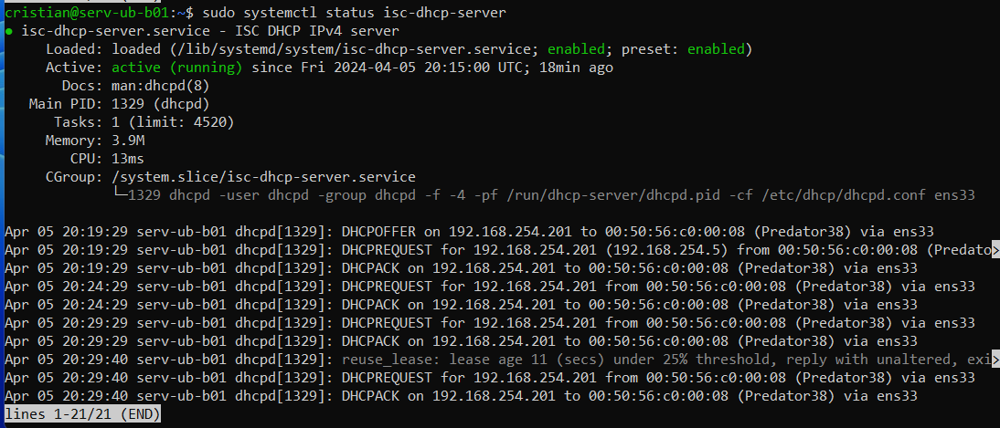

**DNS**

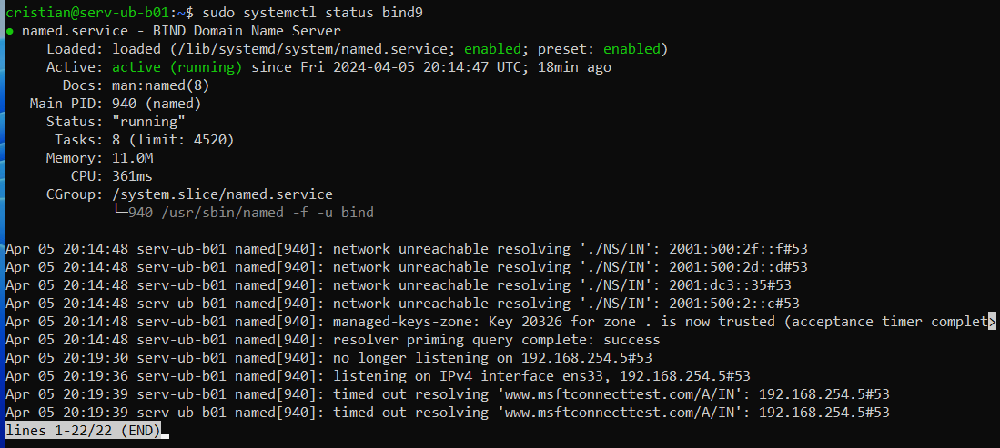

````
nslookup dns-cristan.com
````

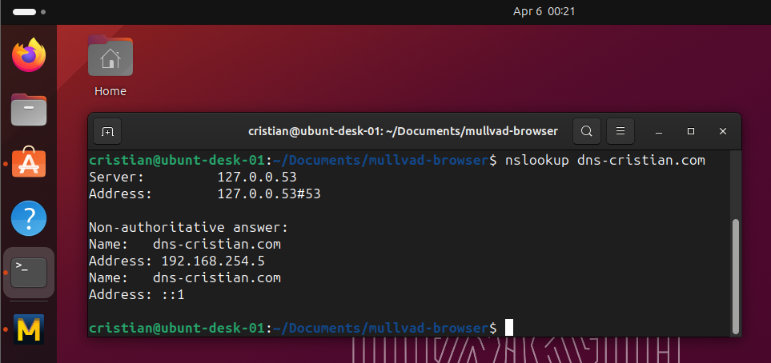

**HTTP**

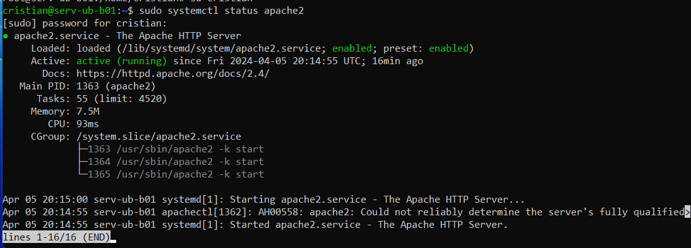

**mariadb (internal website running GLPI)**

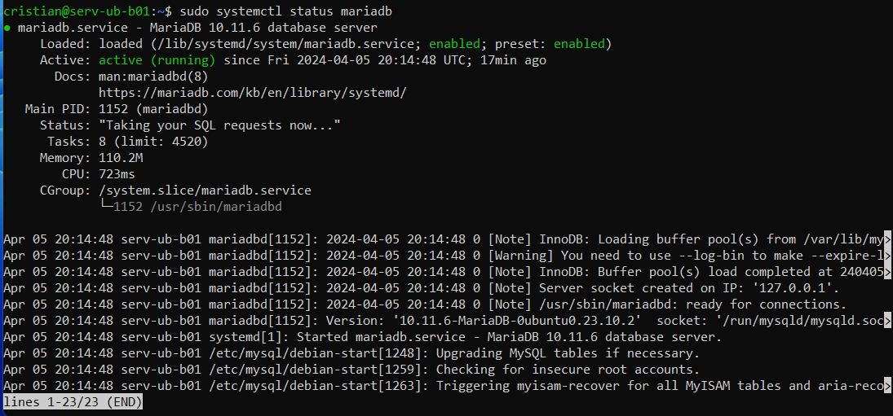


### ubuntu Workstation running a desktop environment

**and the following apps:**

LibreOffice

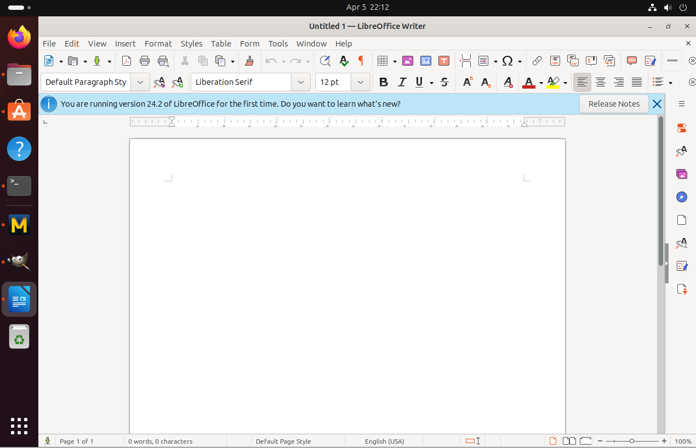

Gimp

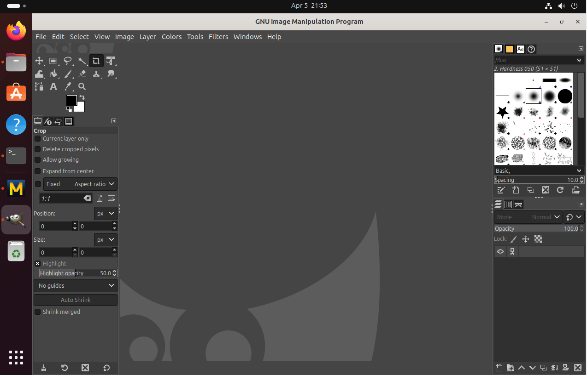

**Mullvad browser** with **GLPI**

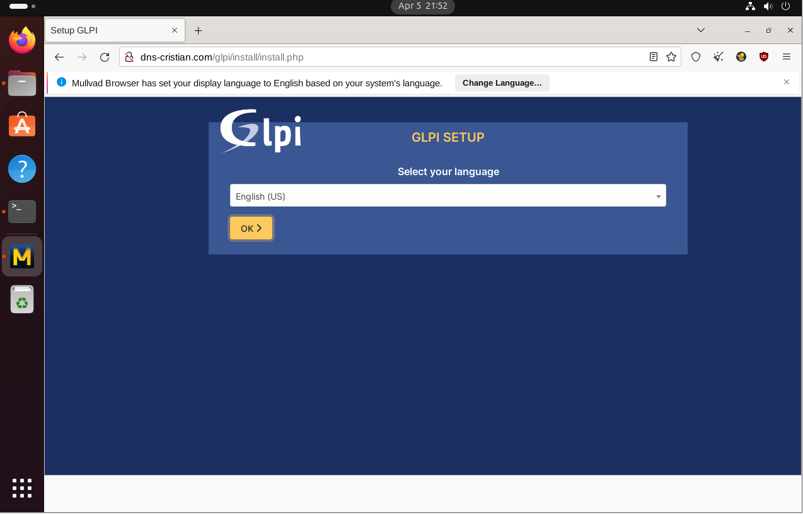

The /home folder is located on a separate partition, same disk.

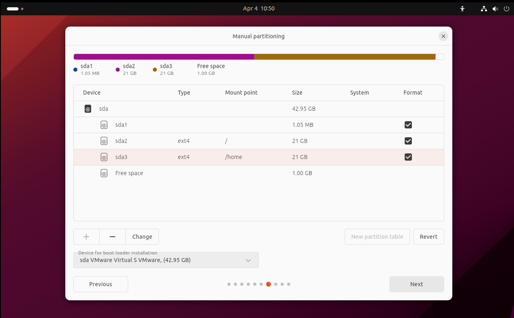


## Part 2.


Ubuntu Desktop username setup

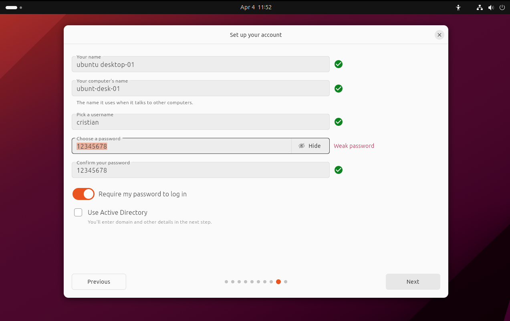

auto IP from DHCP server

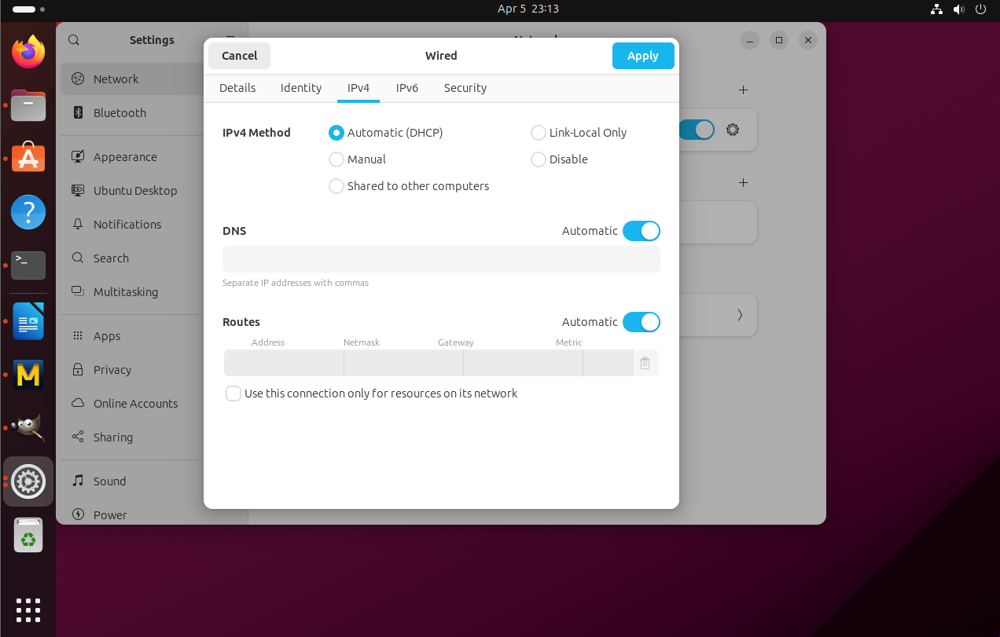

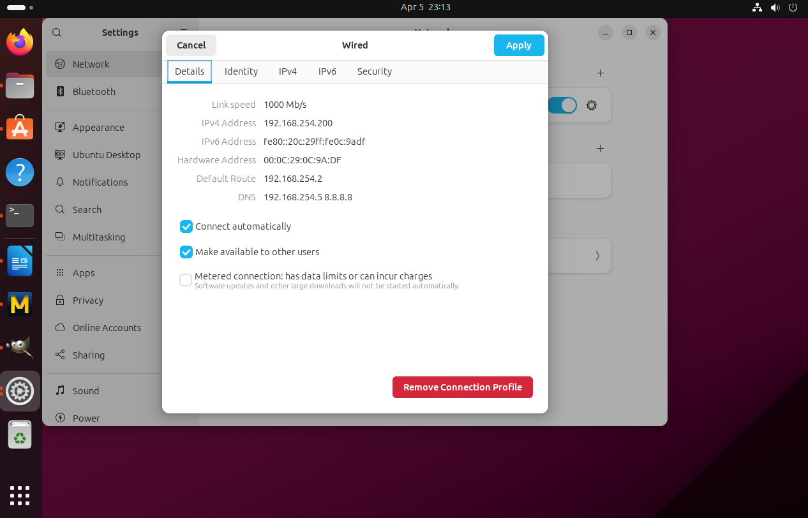


### Server setup:

manual IP setup

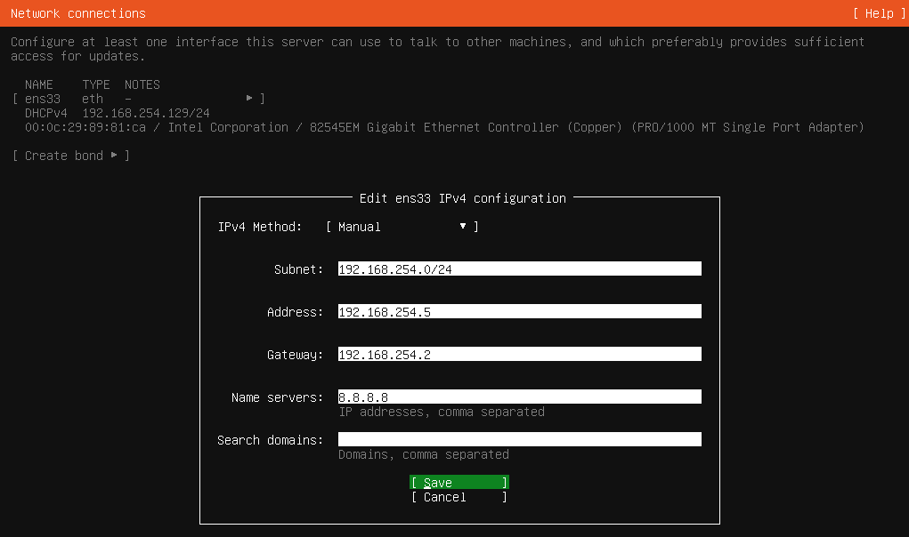

References for:

[Domain Name Service DNS](https://ubuntu.com/server/docs/service-domain-name-service-dns)

[How to install and configure isc-dhcp-server](https://ubuntu.com/server/docs/how-to-install-and-configure-isc-dhcp-server)

[to Install GLPI video](https://www.youtube.com/watch?v=AF5pJaQJXvU)

[to Install GLPI](https://totatca.com/how-to-install-glpi-on-ubuntu/)


server ubuntu 23 updatet and upgraded

cristian simply doctor note config

sudo usermod -aG sudo cristian

sudo apt install bind9

sudo apt install dnsutils

The authenticity of host '192.168.254.5 (192.168.254.5)' can't be established.
ECDSA key fingerprint is SHA256:/krY1aiSUJotg+CfaCFCu0JQduu5ASdJNVegj4xaIFk.


cd /etc/bind/

"

sudo nano named.conf

named.conf.options


forwarders {
    8.8.8.8;
   
};

"

salvat fila "
options {
        directory "/var/cache/bind";

        // If there is a firewall between you and nameservers you want
        // to talk to, you may need to fix the firewall to allow multiple
        // ports to talk.  See http://www.kb.cert.org/vuls/id/800113

        // If your ISP provided one or more IP addresses for stable
        // nameservers, you probably want to use them as forwarders.
        // Uncomment the following block, and insert the addresses replacing
        // the all-0's placeholder.

        forwarders {
                192.168.254.5;
                8.8.8.8;
         };

        //========================================================================
        // If BIND logs error messages about the root key being expired,
        // you will need to update your keys.  See https://www.isc.org/bind-keys
        //========================================================================
        dnssec-validation auto;

        listen-on-v6 { any; };
//};
//forwarders {

"

sudo systemctl restart bind9.service

Primary Server

dns-cristian.com

cd /etc/bind


sudo nano named.conf.local

/etc/bind/named.conf.local:


zone "dns-cristian.com" {
    type master;
    file "/etc/bind/db.dns-cristian.com";
};


sudo cp /etc/bind/db.local /etc/bind/db.dns-cristian.com

sudo nano db.dns-cristian.com


;
; BIND data file for dns-cristian.com
;
$TTL    604800
@       IN      SOA     dns-cristian.com. root.dns-cristian.com. (
                              2         ; Serial
                         604800         ; Refresh
                          86400         ; Retry
                        2419200         ; Expire
                         604800 )       ; Negative Cache TTL

@       IN      NS      ns.dns-cristian.com.
@       IN      A       192.168.254.5
@       IN      AAAA    ::1
ns      IN      A       192.168.254.5

sudo systemctl restart bind9.service

sudo nano named.conf.local

add

zone "254.168.192.in-addr.arpa" {
    type master;
    file "/etc/bind/db.192";
};


sudo cp /etc/bind/db.127 /etc/bind/db.192

sudo nano db.192

;
; BIND reverse data file for local 192.168.254.XXX net
;
$TTL    604800
@       IN      SOA     ns.dns-cristian.com. root.dns-cristian.com. (
                              2         ; Serial
                         604800         ; Refresh
                          86400         ; Retry
                        2419200         ; Expire
                         604800 )       ; Negative Cache TTL
;
@       IN      NS      ns.
10      IN      PTR     ns.dns-cristian.com.

sudo systemctl restart bind9.service

dig -x 127.0.0.0

ok !!!!


config dhcp

sudo apt install isc-dhcp-server

cd /etc/dhcp

sudo nano dhcpd.conf


# minimal sample /etc/dhcp/dhcpd.conf
default-lease-time 600;
max-lease-time 7200;
    
subnet 192.168.254.0 netmask 255.255.255.0 {
 range 192.168.254.199 192.168.254.250;
 option routers 192.168.254.2;
 option domain-name-servers 192.168.254.5, 8.8.8.8;
 option domain-name "dns-cristian.com";
}

cd /etc/default/

sudo nano isc-dhcp-server

INTERFACESv4="ens33"

sudo systemctl restart isc-dhcp-server.service


